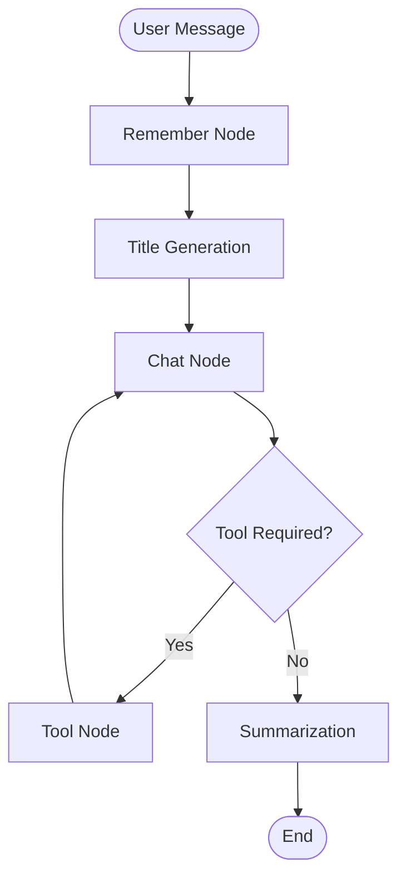

# 🧠 Mindora-AI

### A Stateful AI Assistant with Memory

> **An AI assistant that remembers, uses tools, and maintains context.**

Mindora-AI is a stateful conversational AI assistant built with
**LangGraph**, **LangChain**, **Google Gemini**, and **Streamlit**.

The application goes beyond a basic chatbot by maintaining conversation
state, storing useful user information as long-term memory, supporting
multiple conversations, generating conversation titles, calling external
tools, streaming responses, and summarizing older conversation history.

<p align="center">
[](https://www.python.org/)
[](https://www.langchain.com/langgraph)
[](https://www.langchain.com/)
[](https://ai.google.dev/)
[](https://streamlit.io/)
[](https://www.sqlite.org/)
[](LICENSE)
</p>

------------------------------------------------------------------------

## 📌 Project Overview

Traditional LLM applications often follow a simple pattern:

``` text
User → LLM → Response
```

Mindora-AI uses a more structured approach:

``` text
User Message
     ↓
Memory Extraction
     ↓
Conversation Title Generation
     ↓
Gemini LLM
     ↓
Tool Routing (when required)
     ↓
Response
     ↓
Persistent State and Context Management
```

The project explores how to build an AI assistant that can **remember,
use tools, preserve state, and manage longer conversations**.

------------------------------------------------------------------------

## ✨ Key Features

### 🧠 Long-Term User Memory

Mindora-AI uses structured LLM output to identify information from user
messages that may be useful in future conversations.

The memory workflow determines:

-   Whether information is worth storing
-   Which memory items should be saved
-   Whether a memory is new
-   Whether the assistant should avoid writing anything

The memory prompt instructs the model to store information explicitly
provided by the user and avoid speculation.

------------------------------------------------------------------------

### 💬 Stateful Conversations

Each conversation is associated with a unique conversation/thread ID.

This allows users to maintain separate conversations and switch between
them through the Streamlit sidebar.

``` text
Conversation A
    ├── Message 1
    ├── Message 2
    └── Message 3

Conversation B
    ├── Message 1
    └── Message 2

Conversation C
    ├── Message 1
    ├── Message 2
    └── Message 3
```

------------------------------------------------------------------------

### 💾 Persistent Storage

Mindora-AI uses SQLite for application-level persistence and LangGraph
checkpoint storage.

The application maintains data for:

-   LangGraph checkpoints
-   Conversations
-   Conversation messages
-   Long-term user memory
-   Conversation titles and timestamps

This allows conversation data and workflow state to persist across
application restarts during local development.

> **Privacy note:** The local SQLite database may contain conversation
> content and user memories. Do not commit database files to a public
> repository.

------------------------------------------------------------------------

### 🛠️ Tool Calling

Mindora-AI supports LLM-driven tool calling through LangGraph.

Available tools include:

#### 🔎 Web Search

Uses DuckDuckGo search to retrieve information from the web when the
model determines that search is required.

#### 🧮 Calculator

Supports:

-   Addition
-   Subtraction
-   Multiplication
-   Division

#### 📈 Stock Price Lookup

Uses the Alpha Vantage API to retrieve stock quote information.

Tool execution is routed through LangGraph's tool node and the result is
returned to the LLM for response generation.

------------------------------------------------------------------------

### 📝 Automatic Conversation Titles

Mindora-AI generates a concise title for a conversation based on its
first user message.

This makes conversations easier to identify and revisit from the sidebar
instead of displaying only an internal conversation ID.

------------------------------------------------------------------------

### 🗜️ Conversation Summarization

Long conversations can increase context size and token usage.

Mindora-AI includes a summarization workflow that is triggered when the
conversation exceeds the configured message threshold.

The current implementation:

1.  Detects when the message count exceeds the threshold
2.  Generates a summary of older conversation content
3.  Keeps the most recent messages
4.  Removes older messages from the active state
5.  Continues the conversation using the summary and recent messages

The current threshold is more than **20 messages**, and the
implementation keeps the latest **10 messages**.

------------------------------------------------------------------------

### ⚡ Streaming Responses

The Streamlit frontend streams assistant responses from the LangGraph
workflow so that users can see the response progressively rather than
waiting for the entire response to finish.

------------------------------------------------------------------------

## 🏗️ System Architecture

Mindora-AI consists of the following major components:

1.  **Streamlit Frontend** --- Chat interface and conversation sidebar
2.  **LangGraph Workflow** --- Stateful workflow orchestration
3.  **Google Gemini** --- Language model for conversation and reasoning
4.  **Memory System** --- Structured extraction and persistence of user
    information
5.  **Tool Layer** --- Search, calculator, and stock price lookup
6.  **SQLite** --- Persistence for checkpoints, conversations, messages,
    and memory

``` text
                         ┌──────────────────┐
                         │       USER       │
                         └────────┬─────────┘
                                  │
                                  ▼
                    ┌─────────────────────────┐
                    │    STREAMLIT FRONTEND   │
                    │                         │
                    │  • Chat Interface       │
                    │  • Conversation Sidebar │
                    │  • Streaming Responses  │
                    └────────────┬────────────┘
                                 │
                                 ▼
                    ┌─────────────────────────┐
                    │      LANGGRAPH          │
                    │     STATEFUL WORKFLOW   │
                    └────────────┬────────────┘
                                 │
             ┌───────────────────┼──────────────────┐
             │                   │                  │
             ▼                   ▼                  ▼
      ┌─────────────┐     ┌─────────────┐    ┌─────────────┐
      │ Remember    │     │ Chat Node   │    │ Summarizer  │
      │ Node        │     │             │    │             │
      └──────┬──────┘     └──────┬──────┘    └─────────────┘
             │                   │
             ▼                   ▼
      ┌─────────────┐     ┌─────────────┐
      │ User Memory │     │ Gemini LLM  │
      └─────────────┘     └──────┬──────┘
                                 │
                                 ▼
                          ┌─────────────┐
                          │  Tool Node  │
                          └──────┬──────┘
                                 │
                   ┌─────────────┼─────────────┐
                   ▼             ▼             ▼
                Search       Calculator      Stocks

                                 ▼
                            Gemini LLM
                                 │
                                 ▼
                           Final Response
                                 │
                                 ▼
                           ┌────────────┐
                           │   SQLite   │
                           │            │
                           │ Checkpoints│
                           │Conversations
                           │ Messages   │
                           │ Memory     │
                           └────────────┘
```

------------------------------------------------------------------------

## 🔄 LangGraph Workflow

The main workflow is implemented as a state graph.



### Workflow Components

  -----------------------------------------------------------------------
  Component                           Responsibility
  ----------------------------------- -----------------------------------
  🧠 Remember Node                    Identifies potentially useful
                                      long-term user information

  📝 Title Generation                 Creates a concise title for a
                                      conversation

  💬 Chat Node                        Sends conversation and memory
                                      context to Gemini

  🛠️ Tool Node                        Executes tools selected by the LLM

  🗜️ Summarization                    Compresses older conversation
                                      history

  💾 SQLite Checkpointer              Persists LangGraph workflow state
  -----------------------------------------------------------------------

------------------------------------------------------------------------

## 🧠 Memory Architecture

Mindora-AI separates active conversation state from long-term user
memory.

### Conversation State

Answers:

> **What are we currently talking about?**

### Long-Term Memory

Answers:

> **What useful information has the user explicitly shared that may help
> in future conversations?**

The memory system uses structured output with fields conceptually
similar to:

``` text
MemoryDecision
│
├── should_write
│
└── memories[]
       │
       ├── text
       └── is_new
```

Memory is stored in a namespace-based structure containing:

``` text
namespace
key
value
created_at
updated_at
```

This provides a lightweight foundation for user-specific memory
persistence.

------------------------------------------------------------------------

## 💾 Persistence Architecture

SQLite is used for multiple persistence requirements.

``` text
                         SQLite
                            │
          ┌─────────────────┼─────────────────┐
          │                 │                 │
          ▼                 ▼                 ▼
   ┌─────────────┐   ┌─────────────┐   ┌─────────────┐
   │ Checkpoints │   │Conversations│   │   Messages  │
   │             │   │             │   │             │
   │ LangGraph   │   │ Titles and  │   │ User and AI │
   │ workflow    │   │ metadata    │   │ messages    │
   │ state       │   │             │   │             │
   └─────────────┘   └─────────────┘   └─────────────┘
                                             │
                                             ▼
                                      ┌─────────────┐
                                      │ Long-Term   │
                                      │ Memory      │
                                      └─────────────┘
```

LangGraph checkpoint persistence is handled through `SqliteSaver`, while
application-level conversations, messages, and memory are stored using
custom SQLite tables.

------------------------------------------------------------------------

## 🛠️ Technology Stack

  Technology              Purpose
  ----------------------- ---------------------------------
  **Python**              Core application implementation
  **LangGraph**           Stateful workflow orchestration
  **LangChain**           LLM and tool integration
  **Google Gemini**       Language model
  **Streamlit**           Interactive frontend
  **SQLite**              Persistent storage
  **DuckDuckGo Search**   Web search
  **Alpha Vantage**       Stock information
  **Pydantic**            Structured output validation
  **python-dotenv**       Environment variable management

------------------------------------------------------------------------

## 📁 Project Structure

``` text
Mindora-AI/
│
├── langgraph_backend.py
│   ├── LangGraph workflow
│   ├── Gemini configuration
│   ├── Tool definitions
│   ├── Memory system
│   ├── Conversation persistence
│   ├── Summarization
│   └── Title generation
│
├── streamlit_frontend.py
│   ├── Chat interface
│   ├── Conversation sidebar
│   ├── Conversation switching
│   └── Streaming responses
│
├── prompts.py
│   ├── System prompt
│   └── Memory extraction prompt
│
├── test_memory_db.py
│   └── Memory database test
│
├── cleanup.py
│   └── Database cleanup utility
│
├── requirements.txt
├── LICENSE
└── README.md
```

------------------------------------------------------------------------

## ⚙️ Getting Started

### Prerequisites

Make sure you have:

-   Python 3.10 or newer
-   A Google Gemini API key
-   An Alpha Vantage API key
-   Internet access for web search and external API calls

### 1. Clone the Repository

``` bash
git clone https://github.com/Faraz-05/Mindora-AI.git
cd Mindora-AI
```

### 2. Create a Virtual Environment

#### Linux / macOS

``` bash
python -m venv venv
source venv/bin/activate
```

#### Windows

``` bash
python -m venv venv
venv\Scripts\activate
```

### 3. Install Dependencies

``` bash
pip install -r requirements.txt
```

### 4. Configure Environment Variables

Create a `.env` file in the project root:

``` env
GEMINI_API_KEY=your_gemini_api_key
ALPHA_VANTAGE_API_KEY=your_alpha_vantage_api_key
```

> ⚠️ Never commit `.env` files or API keys to GitHub.

### 5. Run the Application

``` bash
streamlit run streamlit_frontend.py
```

Streamlit will display a local URL where you can access Mindora-AI.

------------------------------------------------------------------------

## 🧪 Testing

The project currently includes a database test for long-term memory.

Run:

``` bash
python test_memory_db.py
```

Potential future test coverage includes:

-   Memory extraction
-   Tool routing
-   Graph transitions
-   Conversation persistence
-   Summarization
-   Title generation
-   Error handling

------------------------------------------------------------------------

## 🔐 Security Considerations

Mindora-AI currently uses environment variables for API credentials.

For production use, additional security measures would be needed,
including:

-   Authentication
-   Authorization
-   Strong per-user memory isolation
-   Secret management
-   API rate limiting
-   Input validation
-   Database access controls
-   Error monitoring
-   Audit logging

The current project should be considered a **portfolio and learning
project with production-oriented architecture**, not a production-ready
SaaS application.

------------------------------------------------------------------------

## 💡 Engineering Highlights

This project demonstrates practical experience with:

-   Stateful LLM workflows
-   LangGraph orchestration
-   Long-term memory
-   Tool-augmented LLMs
-   Conditional workflow routing
-   SQLite checkpoint persistence
-   Conversation management
-   Context-window management
-   Structured LLM output
-   Streaming responses
-   External API integration
-   LLM-powered conversation titles

------------------------------------------------------------------------

## 🔮 Roadmap

Potential future improvements include:

-   [ ] PostgreSQL-based persistence
-   [ ] Authentication and authorization
-   [ ] Strong multi-user memory isolation
-   [ ] Semantic memory retrieval with embeddings
-   [ ] Memory ranking and relevance filtering
-   [ ] Additional tools
-   [ ] Improved error handling and retries
-   [ ] Observability and tracing
-   [ ] Token and cost monitoring
-   [ ] Docker-based deployment
-   [ ] Production deployment
-   [ ] Memory management interface
-   [ ] Expanded unit and integration testing

------------------------------------------------------------------------

## 📌 Project Status

🚧 **Active Learning and Experimentation Project**

Mindora-AI is designed as a hands-on exploration of stateful
conversational AI, memory, tool calling, workflow orchestration, and
persistence.

The architecture can be extended with stronger retrieval,
authentication, observability, testing, and production infrastructure.

------------------------------------------------------------------------

## 👨‍💻 Author

### Faraz

Software Engineer focused on **Generative AI, Agentic AI, and Backend
Systems**.

-   GitHub: [@Faraz-05](https://github.com/Faraz-05)

------------------------------------------------------------------------

<p align="center">
### 🧠 Mindora-AI

**An AI assistant that remembers.**

⭐ Explore the repository and experiment with the architecture.
</p>
